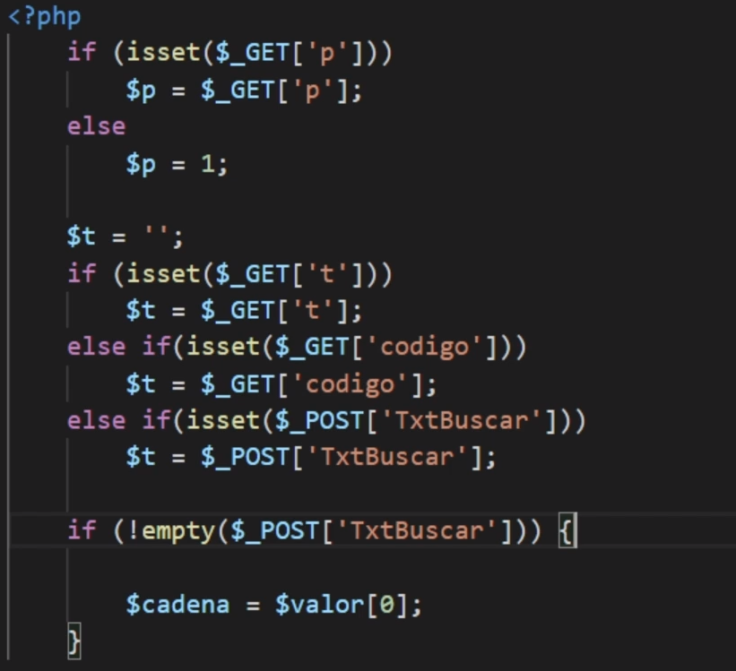

# [Code Writing Good Practice Course](https://platzi.com/clases/mejor-codigo)

This repository contains the practices, exams, exercises and notes of the good practice course for writing code

### Notes:

### Clase 1: Introducción y bienvenida

#### **Para Recordar**

Es importante las buenas practicas para tener aplicaciones más robustas, más escalables y más mantenibles en el tiempo.

#### **Palabras Claves**

Principios Solid, TTD > Test Driven Development


### Clase 2: ¿A quién beneficia contar con código bien escrito?

#### Notas

- El código bien escrito será más fácil retomar el proyecto después.
- Beneficia al equipo de trabajo, que cualquiera pueda modificar después de uno.
- El cliente se beneficia, porque será más fácil y económico mantener el código. También será más rápido hacer el desarrollo e implementación.

**RESUMEN**: 
El código bien escrito beneficia a todos los involucrados en el proyecto.
**A tí:** Cuando retomemos un proyecto después de un largo tiempo nos beneficiará ya que sabremos cómo está ordenado y cómo está escrito todo.
**A cualquiera:** Cualquier persona que deba modificar el código después de tí.
**A tu cliente:** Aunque nunca lo sabrá, su negocio estará mejor atendido.

### Clase 3: Ejes que hacen a la calidad del código

#### Notas

- Ejes que hacen a la calidad del codigo:
- Se mide por: Características externas e internas.
- Externas: Percepciones de los usuarios
- Internas: Cuando se analiza el código
- **INTERNAS:**
- Legibilidad: Que esfuerzo hay que hacer para leer el código. Ej: Identación
- Mantenibilidad: Cuanto esfuerzo supondrá adaptar el código a nuevos requerimientos
- Testeabilidad: Cuanto esfuerzo supondrá realizar pruebas

**RESUMEN**: 
Los siguientes elementos dotan de calidad al código:
**Legibilidad:** qué tan fácil es interpretar lo que el código dice.
**Mantenibilidad:** cuánto esfuerzo supondrá adaptar el código a nuevos requerimientos.
**Testeabilidad:** cuánto esfuerzo supondrá realizar pruebas sobre este código.

### Clase 4: Código prolijo

#### **Para Recordar**

- El código fuente se escribe para humanos.
- Un estándar de codificación son reglas para definir cómo debes escribir el código. Se deben definir antes de ponerse a escribir el código.


#### Notas

- Es mejor tener:
```
test() {
    code...
} 
```

que

```
test()
{
code....
}
```
Es más prolijo el primer caso. Hace que sea más fácil saber que lineas pertenecen a los bloques
- Hay que definir estándares de codificación. Usaremos llaves en todos o no poder las llaves en ninguna. Lo mejor es poner llaves aunque sea una linea



**Estándar de codificación**

- Permite un código claro y consistente
- Evita que pierdas el tiempo en decisiones triviales

**Tips:**

- Definir un estándar de o usar uno
- Respeta el estándar que escogiste.
- Apóyate en Linters. Para ayudarte a usar los estándares

**RESUMEN**:
El código fuente lo escribimos para personas como tú y yo, para las computadoras tenemos las versiones compiladas.

Debemos seguir un estándar de codificación, el cual nos ayuda a:
* Generar código claro y consistente.
* Evitar perder tiempo en decisiones triviales.

**Tips** para mejorar la legibilidad de nuestro código:
* Define un estándar: Piénsalo una vez y déjalo por escrito.
* Respétalo: Haz un esfuerzo por adherir al estándar durante tu día a día.
* Apóyate en algún linter: Esta sencilla herramienta te ayudará a incorporar buenas prácticas.

### Clase 5: Identificadores mnemotécnicos, específicos y precisos

#### **Para Recordar**

Hay dos problemas difíciles:
1. Invalidar los caches y
2. Nombrar las cosas 

Hay que tener atención con los identificadores

Se puede pedirle a un compañero que lea el código a ver si lo entiende.

#### Notas

- Identificador: Nombre que le damos a una variable, clase, componente.

**RESUMEN**: Los identificadores son variables, funciones, clases, módulos, componentes, etc. Elementos a los que nosotros debamos crearles un nombre propio.

### Clase 6: Código modular

#### Notas

- El código modular es código en pequeños bloques.
- Se puede hacer en el contenido de if, ciclos
- Condiciones muy largas una función que devuelva true or false.
- 

**RESUMEN**: El código modular son pedazos de códigos divididos que pueden ser utilizados en cualquier lugar para evitar tener un solo archivo con un bloque de código gigante.

### Clase 7: Código reutilizable

#### **Para Recordar**

El copy y paste es el peor enemigo.

#### Notas

- El código re utilizable es código, es código que se puede usar en varias ocasiones.
- Los código re utilizables recibe parámetros y devuelve resultados.

**RESUMEN**: Escribir código reutilizable nos va a ayudar a que en lugar de copiar y pegar una misma línea de código pero con diferentes parámetros lo hagamos a través de una función que retorne los valores que necesitamos y luego la podremos llamar en cualquier lugar del código que necesitemos pasándole los parámetros que deseamos.

### Clase 8: Código organizado

#### Notas

- Como está organizado el código en el sistema de archivos. (Workspace)
- Agrupar archivos que tengan sentido en común.
- /public todos los archivos accesibles por el publico
- /src el código fuente
- /tests las pruebas del proyecto
- /vendor librerias de terceros
- Una buena estructura de proyecto, permite en encontrar más fácil. El código

**RESUMEN**: El código organizado se refiere a cómo tenemos distribuido nuestros archivos en la raíz (root) del proyecto. A mayor organización, mayor entendimiento del código.

### Clase 9: Evitar el hardcoding

#### **Para Recordar**

Un cambio fácil podría ser complejo si las cosas están hardcodeadas.

Los cosas de piedra son difíciles de modificar.

#### Notas

- El hardcoding es un vicio que hay que evitar.
- Usar identificadores en vez de valores literales.

El mensaje que se imprime con iva es estático, por lo que no se modifica si cambiamos el valor del iva.


Una mejor forma:


Lo mejor es tener un archivo que tenga los valores en json o cualquier otro formato. Por lo que solo es modificar el valor en el archivo json para que se cambie en todo el programa.

- El hardcoding puede hacer que sea más dificil recordar de que se trata esos valores.

**RESUMEN**: El hardcoding es la práctica de escribir valores literales en lugar de identificadores. No debe de usarse, ya que si el día de mañana debemos cambiar los valores eso significa que debemos cambiar el código en los lugares que esté ese valor estático por completo y luego mandar a producción, cuándo podríamos hacer el cambio más orgánico en una variable que afecte a todos los lugares que es llamada.

### Clase 10: Evitar efectos colaterales

#### **Para Recordar**

Lo mejor es no utilizar variables globales.

#### Notas

- Un efecto colateral es un efecto que se da en otro lugar aparte del código que estas haciendo. **Modificar una variable global puede cambiar una funcionalidad diferente a la que estas codificando.**
- Para entender un programa que usa variables globales no basta con leer el código en algunas ocasiones.

**RESUMEN**: Debemos analizar muy bien nuestro código para evitar efectos colaterales y evitar que nuestro código deje de funcionar. Un consejo de nuestro profesor en esta clase: No uses variables globales.

### Clase 11: Principios SOLID: Single Responsibility Principle

#### Notas

- SOLID hace referencia a 5 principios de POO.
- Ayudan a crear software mantenible
- Aplicar los principios mientras vamos desarrollando y al finalizar para ver si se puede hacer el software más robusto.

S: Single Reponsibility Principle

- Una clase solo debe tener solo una responsabilidad. Alta cohesion.
- Permite encontrar bugs más fáciles.
- Hace el código más reutilizable
- EVITAR clases dios que hacen todos.

**RESUMEN**: 
**SOLID** son cinco principios básicos de la programación orientada a objetos que ayudan a crear software mantenible en el tiempo.

**SOLID** significa:

S: Single Reponsibility Principle
O: Open/Closed Principle
L: Liskov Substitution Principle
I: Interface Segregation Principle
D: Dependency Inversion Principle
La S se trata de una clase que debe tener sólo una razón para cambiar.

### Clase 12: Open/Closed Principle

#### Notas

- El principio de open/close propone una forma de estructurar las clases.
- Que las clases se puedan adaptarse a nuevos requerimientos. Sin tener que modificar su estructura interna.
- Que sea solo crear el nuevo componente.
- Puede llegarse a métodos muy grandes y llenos de casos especiales
- Hay que asignar las responsables entre las clases llamadas y las llamadoras.

Este es un caso donde se evalúa según el tipo de documento. Pero si entra un documento nuevo tocaría modificar el método para más documentos. Cada uno es un caso especial.


Una mejor forma sería llamar el método proccess de cada documento. Así no tenemos que ver casos especiales. La responsabilidad de procesar el documento le corresponde a cada clase.


**RESUMEN**: Open/Closed Principle establece que una entidad de software debe quedarse abierta para su extensión, pero cerrada para su modificación.

### Clase 13: Liskov Substitution Principle

#### Notas

- En relación de herencia, una situación que tenga que recibir una clase padre, podría recibir una clase hija sin conocer la diferencia entre ellas.

Para cumplir con este principio:

- El cliente (Función) solo debe usar los métodos de la clase padre.
- La clase hija no debe alterar el comportamiento de la clase padre.

Cuando no se cumple este principio. Hay que cuestionarse si la relación entre padre e hijo es realmente una relación de herencia.

**RESUMEN**: 
El Liskov Substitution Principle establece que cada clase que hereda de otra puede usarse como su padre sin necesidad de conocer las diferencias entre ellas. Para que pueda darse este principio debe cumplir con dos puntos:

- El cliente debe usar métodos de la clase padre únicamente.
- La clase hija no debe alterar el comportamiento de los métodos de la clase padre.

### Clase 14: Interface Segregation Principle

#### Notas

- Nos dice como estructurar las interfaces.
- Cuando una clase implementa una interfaz, debe implementar solo los métodos que necesita. No debe pedirsele implementar métodos que NO va a usar

Ejemplo:

Una clase que siempre devuelve false y siempre lanza una excepción. Puede que no necesite tener esos métodos.


Lo mejor sería sacar dos interfaces uno para programador y otro para el tester.


Podemos mandar una clase que implemente una interfaz


**RESUMEN**: El **Interface Segregation Principle** establece que los clientes de un programa sólo deberían conocer de éste los métodos que realmente usan.

### Clase 15: Dependency Inversion Principle

#### Notas

- Ayuda a definir como se vinculan las clases que deben darle servicios a otras.
- Hay clases de alto y bajo nivel
- Clases de alto nivel: Tienen que ver con la lógica del negocio, la aplicación que se está desarrollando.
- Clases de bajo nivel: Están para ayudar que las clases de alto nivel puedan cumplir con su cometido.
- El principio busca desacoplar la dependencias.

Ej: Las notificaciones se envían según la severidad. 


Sin embargo, el notificador depende de los métodos de envio. Tiene una dependencia fuerte.


Si cambiamos el método para enviar los correos. Tendremos que modificar el constructor para el envío de correos.

Una mejor aproximación es que no se instancie el notificador, si no que podamos enviarle uno en especifico.


EmailSender, SMSSender y WhtsappSender deben ser interfaces para que podamos enviar cualquier clase que implemente esas interfaces.

Eso hace que Notifier pierda noción de que servicios está trabajando, solo sabe que debe llamar y que le van a solucionar el llamado.

Retos: 

```php
<?php
/*
Problema: 
Este no cumple el principio de responsabilidad única ya que hace muchas funcionalidades
como cargar, agregar, eliminar, guardar.
Solución: 
Crear tres clases que repartan las responsabilidades. Ej: Order, OrderRepository, 
OrderPrinter.
*/
    class Order
    {
        public function calculateTotalSum(){/*...*/}
        public function getItems(){/*...*/}
        public function getItemCount(){/*...*/}
        public function addItem($item){/*...*/}
        public function deleteItem($item){/*...*/}

        public function printOrder(){/*...*/}
        public function showOrder(){/*...*/}

        public function load(){/*...*/}
        public function save(){/*...*/}
        public function update(){/*...*/}
        public function delete(){/*...*/}
    } 
```

```php
<?php
/*
Problema: No cumple con el principio de sustitución de Liskov porque cambia el
comportamiento del padre.
Solución: Usar una interfaz FlyerAnimal para que pueda ser implementada solo por animales
que pueden volar. No todos los animales.

*/
    class Animal
    {
        public function fly()
        {
        }
    }

    class Dog extends Animal
    {
        public function fly()
        {
            if (! $this->hasWings) {
                throw new Exception;
            }
        }
    }
```

**RESUMEN**: 
**Dependency Inversion Principle** detalla que los módulos de alto nivel no deben depender de los de bajo nivel, ambos deben depender de abstracciones.

Las abstracciones no deben depender de los detalles, los detalles deben depender de las abstracciones.

### Clase 16: Patrones de diseño: Singleton

#### Notas

- Los patrones de diseño son instrucciones  para dar soluciones a problemas comunes a la hora de hacer código.
- Tipos patrones de diseño: creación, estructurales, comportamiento.

**PATRÓN SINGLETON:**

- Se crea UNA SOLA INSTANCIA de la clase.


El patrón singleton se puede usar en logs.

**RESUMEN**: 
Los patrones de diseño son soluciones de arquitectura de software aplicables a diferentes problemas.

El patrón Singleton permite restringir la creación de objetos pertenecientes a una clase o al valor de un tipo a un único objeto.

### Clase 17: Factory

#### Notas

- Factory es un patrón creacional.
- Se usa cuando crear un objeto es muy complejo. Ej: crear el objeto tiene muchos parámetro o requiere hacer operaciones.

Sin factory:


Con Factory:


Puede cambiar el método para crear el auto, peor al factory no le importa.

**RESUMEN**: El patron Factory es creacional, se utiliza para ayudar a la creación de nuevas instancias de objetos.

### Clase 18: Command

#### **Para Recordar**

Una mejor explicación sobre este patrón:

[Patrón de diseño Command - Oscar Blancarte - Software Architecture](https://www.oscarblancarteblog.com/2014/11/19/patron-de-diseno-command/)

#### **Palabras Claves**

#### **Preguntas Importantes**

#### Notas

- Es un patrón de comportamiento
- Se utiliza cuando existe una operación compleja que debe ser realizada desde diferentes puntos de entrada.
Ej: Una consulta web de un usuario que requiere ejecutar un comando en el servidor.

**Implementación:**

Se crea una interfaz que tenga el método execute
El execute hará el comando especifico que se necesita. 


**RESUMEN**: El patrón Command permite solicitar una operación a un objeto sin conocer realmente el contenido de esta operación, ni el receptor real de la misma. Para ello se encapsula la petición como un objeto, con lo que además facilita la parametrización de los métodos.

### Clase 19: Introducción al Testing Automatizado

#### **Para Recordar**

Los errores siempre van a ocurrir por eso hay que tratar de encontrarlos y corregirlos lo más pronto posible.

#### Notas

- Las pruebas sirven para encontrar errores y posteriormente corregirlos
- Hay unit testing e integration testing
- **Unit testing:** Cada unidad de software se saca del contexto y se valida que hace lo que tiene que hacer.  Ayuda al refactor y fácil integración y dejar el código documentado.
- **Integration testing:** Validar la interacción entre los componentes.

**RESUMEN**: 
Existen dos tipos de testing:

- **Unit Testing:** Evaluamos el funcionamiento de los componentes individualmente.
- **Integration Testing:** Validar la interacción entre los componentes y el sistema completo.

### Clase 21: Ejes que hacen a la calidad del código

#### Notas

- Es una metodología que propone primero hacer las pruebas y luego el código.


**RESUMEN**:  
Test Driven Development nos ayudará a reducir al mínimo los errores de nuestra aplicación aplicando primero las pruebas y luego el código de la aplicación.

TDD o Test Driven Development es una metodología donde hacemos todo al revés. Por un momento vamos a dejar de programar para dedicarnos a escribir las pruebas.

### Clase 22: Pull requests

#### Notas

- Normalmente se hace un fork del repositorio y luego se hace un Pullrequest

**RESUMEN**: 
Los pull request son pedidos de mejora a archivos de un proyecto generalmente open source. Sirve para que la comunidad ayude a mejorar el código que ha sido escrito por ti, tu equipo o una empresa; luego de que realizamos un cambio generamos un pull request para ofrecer un cambio a mejora y solo queda esperar a que el dueño del repositorio lo pruebe y lo agregue a el código principal.

### Clase 23: Documentación

#### Notas

- Documentar es una buena practica.
- Se trata de dejar por escrito las decisiones que hemos tomado, como funciona el código, etc.

¿Qué documentar?

- Lo mínimo que otra persona deba saber para continuar el trabajo donde lo dejaste.
- ¿Cómo implementar una nueva funcionalidad?
- ¿Cómo llevar nuevo código a producción?
- ¿Cómo se realiza las pruebas?
- ¿Quienes son los involucrados en ese código? Para saber a quien contactar.

¿Cómo documentar?

- ¿Quien va a leer la documentación?
    - Si es alguien técnico se usa un lenguaje técnico
    - Si no, un lenguaje más coloquial.
    - Usar UML

¿Dónde documentar?

- Dentro del mismo código: Precisa, clara y pequeña.
- Documentos / wikis

¿Cuando documentar?

- A la par del código, apenas hacer el código documentarlo.
- Cuando solucionaste un problema complejo.

**RESUMEN**: 
Documentar es una de las mejores prácticas que podemos hacer cuando estamos en un equipo de trabajo. Dejar por escrito cómo hemos hecho algunas funcionalidades, cómo podría ser mejorado el código y por sobretodo debemos dejar s en el código que ayuden a las personas a ubicarse en qué parte de la aplicación están y qué hacen esas líneas de código.

### Clase 24: A quién beneficia el código bien escrito

#### Notas

- El código  limpio se beneficia a:
    - Uno mismo
    - Compañeros
    - Clientes
- Determinar el código es de calidad:
    - Legabilidad
    - Mantenibilidar
    - Testeabilidad
- Temas a tener en cuenta:
    - La forma en la que se escribe el código
    - Los nombres que se utilizan
    - El diseño de las clases
    - No se trata solo de código: Documentar es importante.

Utilizar frameworks resuelve problemas comunes, lo cual permite ahorrar tiempo y permite concentarse en los problemas de la aplicación. 

Los frameworks suelen tener todas las buenas practicas implementadas.

**RESUMEN**: 
La primera persona a quien beneficiará es a nosotros mismos, lograremos entender nuestro código no importa el tiempo que pase.

Nuestros compañeros lograrán entender muchísimo más nuestro código luego de todas las buenas prácticas que hemos realizado. Y finalmente a nuestro cliente que aunque no pueda ver al detalle nuestro código, estará mejor organizado y podrá ser leído por cualquier persona.

### Clase 25: Aplicar lo aprendido: Libro de visitas

#### **Para Recordar**

Ejemplo de buenas practicas:

[mchojrin/GuestBook](https://github.com/mchojrin/GuestBook.git)

### EXAMEN

[Examen del Curso de Buenas Prácticas para Escritura de Codigo.pdf](resources/Examen_del_Curso_de_Buenas_Prcticas_para_Escritura_de_Codigo.pdf)