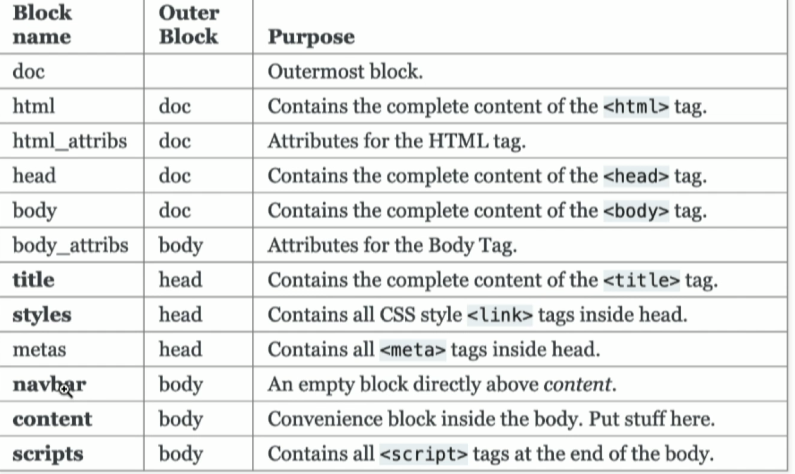

#  [Curso de Flask](https://platzi.com/clases/flask/)

This repository contains my notes and a project done in the course.

The project consists of a task management application.

## Notes:

### Clase 2: ¿Cómo funcionan las aplicaciones web?

#### Notas

- Aplicación web: Es un programa que por medio de tecnologías web y un navegador se conecta con un servidor.

**RESUMEN**: 
Cuando utilizas una aplicación web puedes interactuar con ella desde una computadora hasta un dispositivo móvil, pero esto no quiere decir que consume el procesamiento de tu dispositivo. Todo lo contrario, se hace en una red de servidores.

Estos servidores unen su poder de procesamiento con el fin transmitir solicitudes a todo el mundo, a su vez utilizar servidores especializados para almacenar los datos con los cuales se está trabajando, así como los datos de los demás usuarios. Como todo esto sucede sin demora alguna, parecerá que la aplicación se está ejecutando de forma nativa en tu dispositivo.

El servidor procesa la información obtenida por el navegador, luego se realizan los procedimientos necesarios de acuerdo a la lógica de negocio de la aplicación para regresar la información solicitada al cliente.

**Ejemplo:**

Cuando utilizamos Google Drive el cual es una aplicación web y abrimos un documento con Google Docs, el navegador se comunica con los servidores para ver y editar el documento.

A medida que vayas editando el documento, tu navegador trabajará de la mano con los servidores para asegurarse que todos los cambios se estén guardando.

**Ventajas**:

- Muchas de las aplicaciones web que existen son gratuitas.
- Puedes acceder a tu información en cualquier momento y lugar.
- No dependes de un dispositivo en específico ya que la aplicación se encuentra almacenada en la web.

### Clase 3: ¿Qué es Flask?

#### Notas

- Flask es un microframework, es decir que intenta que su infraestructura principal sea lo más simple posible.
- Flask permite agregar lo que vayamos necesitando a medida que vamos construyendo la aplicación web.
- Se puede aumentar las funciones de flask con librerias (Flask Extensions)
- Flask no tiene un ORM, no maneja MVC como django. Sin embargo, se pueden ir incluyendo a medida que se requiera.

**RESUMEN**: 
Flask es un framework minimalista escrito en Python que permite crear aplicaciones web rápidamente y con un mínimo de líneas de código, busca que su infraestructura inicial sea lo más simple posible y pueda personalizarse fácilmente, puedes extender sus funcionalidades con las llamadas Flask Extensions http://flask.pocoo.org/extensions/

### Clase 5: Hello World Flask

#### Notas

- Para crear un entorno virtualenv con python 3.7

```bash
virtualenv venv --python=python3.7
```

- Para desactivar el entorno virtual se hace con

```bash
deactive
```

Para ver las dependencias instaladas:

```bash
pip freeze
```

Para identificar el archivo de la aplicación

```bash
# Linux
export FLASK_APP=main.py

# Windows
set FLASK_APP=main.py

# Entorno virtual windows
set $env:FLASK_APP = 'main.py'
```

Correr flask

```bash
flask run
```

Hello world

```python
from flask import Flask

app = Flask(__name__) # __name__ indica que el nombre de la aplicación será el nombre del archivo

@app.route('/')
def hello():
    return "Hello, World Flask"
```

**RESUMEN**: 
- **virtualenv:** es una herramienta para crear entornos aislados de Python.

- **pip**: es el instalador de paquetes para Python.

- **requirements**.**txt**: es el archivo en donde se colocará todas las dependencias a instalar en nuestra aplicación.

- **FLASK_APP**: es la variable para identificar el archivo donde se encuentra la aplicación.

### Clase 6: Debugging en Flask

#### Notas

- **Debugging:** es el proceso de identificar y corregir errores de programación.

Para activar el debug hay que definir la variable de entorno:

```python
FLASK_DEBUG=1
```

**RESUMEN**: 

### Clase 7: Request y Response

#### Notas

- Flask provee variables de contexto con la cual se puede obtener información de la aplicación.
- 

**RESUMEN**: 
**Logging:** es una grabación secuencial en un archivo o en una base de datos de todos los eventos que afectan a un proceso particular.

Se utiliza en muchos casos distintos, para guardar información sobre la actividad de sistemas variados.

Tal vez su uso más inmediato a nuestras actividades como desarrolladores web sería el logging de accesos al servidor web, que analizado da información del tráfico de nuestro sitio. Cualquier servidor web dispone de logs con los accesos, pero además, suelen disponer de otros logs, por ejemplo, de errores.

Los sistemas operativos también suelen trabajar con logs, por ejemplo para guardar incidencias, errores, accesos de usuarios, etc.

A través de los logs se puede encontrar información para detectar posibles problemas en caso de que no funcione algún sistema como debiera o se haya producido una incidencia de seguridad.

### Clase 9: Templates con Jinja 2

#### Notas

- Los templates permiten renderizar información estatica y dinamica.

**RESUMEN**: 

### Clase 10: Estructuras de control

#### Notas

Url_for nos permite obtener la ruta por medio del nombre de la función

```html
<a href="{{ url_for('index')}}">Ir a inicio</a>
```

Ejemplo de iterador:

```html

        <tr>
                <td>{{ key }}td>
                <td>{{ segment }}td>
        tr>

```

**RESUMEN**: 
Iteración: es la repetición de un segmento de código dentro de un programa de computadora. Puede usarse tanto como un término genérico (como sinónimo de repetición), así como para describir una forma específica de repetición con un estado mutable

### Clase 11: Herencia de templates

#### Notas

- Los macros son pequeños  pedazos de código reutilizables que se repetirán en varias partes del código.

```html

    
        <li class="active"><a href="{{ url_for(endpoint) }}">{{text}}</a></li>
    
        <li><a href="{{ url_for(endpoint) }}">{{text}}</a></li>
    

```

```html

<!DOCTYPE html>
<html lang="en">
    <head>
    
        <title>My application</title>
    
    </head>
    <body>
        <ul class="nav-list">
            {{ nav_link('home', 'Home') }}
            {{ nav_link('about', 'About') }}
            {{ nav_link('contact', 'Get in touch') }}
        </ul>
    
    
    </body>
</html>
```

Como podemos observar en la primera línea estamos llamando a macros.html que contiene todos nuestros macros, pero queremos uno en específico así que escribimos import nav_link para traer el macro deseado y lo renderizamos de esta manera en nuestro menú {{ nav_link('home', 'Home') }}.

**RESUMEN**: 
Macro: son un conjunto de comandos que se invocan con una palabra clave, opcionalmente seguidas de parámetros que se utilizan como código literal. Los Macros son manejados por el compilador y no por el ejecutable compilado.

Los macros facilitan la actualización y mantenimiento de las aplicaciones debido a que su re-utilización minimiza la cantidad de código escrito necesario para escribir un programa

### Clase 13: Uso de archivos estáticos: imágenes

#### **Para Recordar**

```bash
# Recargar el navegador borrando el cache
crl + shift + R
```

#### Notas

**RESUMEN**: 

### Clase 14: Configurar páginas de error

#### **Para Recordar**

Flask provee la función de errorhandler para manejar errores

#### Notas

**Códigos de error:**

- **100**: no son errores sino mensajes informativos. Como usuario nunca los verás, sino que entre bambalinas indica que la petición se ha recibido y se continúa el proceso.
- **200**: estos códigos también indican que todo ha ido correctamente. La petición se ha recibido, se ha procesado y se ha devuelto satisfactoriamente. Por tanto, nunca los verás en tu navegador, pues significan que todo ha ido bien.
- **300**: están relacionados con redirecciones. Los servidores usan estos códigos para indicar al navegador que la página o recurso que han pedido se ha movido de sitio. Como usuario, no verás estos códigos, aunque gracias a ellos una página te podría redirigir automáticamente a otra.
- **400**: corresponden a errores del cliente y con frecuencia sí los verás. Es el caso del conocido error 404, que aparece cuando la página que has intentado buscar no existe. Es, por tanto, un error del cliente (la dirección web estaba mal).
- **500**: mientras que los códigos de estado 400 implican errores por parte del cliente (es decir, de parte tuya, tu navegador o tu conexión), los errores 500 son errores desde la parte del servidor. Es posible que el servidor tenga algún problema temporal y no hay mucho que puedas hacer salvo probar de nuevo más tarde.

**RESUMEN**: 

### Clase 15: Flask Bootstrap

#### Notas

- Documentación:

[Flask-Bootstrap](https://pythonhosted.org/Flask-Bootstrap/)

Algunos bloques de Flask Bootstrap.



**RESUMEN**: 
Framework: es un conjunto estandarizado de conceptos, prácticas y criterios para enfocar un tipo de problemática particular que sirve como referencia, para enfrentar y resolver nuevos problemas de índole similar.

### Clase 16: Configuración de Flask

#### Notas

- **SESSION**: es un intercambio de información interactiva semipermanente, también conocido como diálogo, una conversación o un encuentro, entre dos o más dispositivos de comunicación, o entre un ordenador y usuario.

Activar el development mode

```bash
#linux
export FLASK_ENV=development

#Windows
$env:FLASK_ENV="development"
```


**RESUMEN**: 

### Clase 17: Implementación de Flask-Bootstrap y Flask-WTF

#### Notas

- **WTF**: What The Forms. Es una libreria de Python para renderizar y validar formularios
- WTF no necesita instanciación. Con instalarlo ya se puede hacer uso de él.

**RESUMEN**: 

### Clase 18: Uso de método POST en Flask-WTF

#### **Para Recordar**

Documentación: 

[Quickstart - Flask-WTF 0.14](https://flask-wtf.readthedocs.io/en/stable/quickstart.html)

#### Notas

```python
validate_on_submit()
```

Detecta cuando se envía un POST y valida el formulario 

- Las variables que usamos en el formulario tienen filtros.

Ejemplo:

```python
{{ username | capitalize  }}
```

Eso vuelve la variable username en capitalize

- Flask acepta peticiones GET por defecto y por ende no debemos declararla en nuestras rutas.

    Pero cuando necesitamos hacer una petición POST al enviar un formulario debemos declararla de la siguiente manera, como en este ejemplo:

    ```python
    @app.route('/platzi-post', methods=['GET', 'POST'])
    ```

    Debemos declararle además de la petición que queremos, GET, ya que le estamos pasando el parámetro methods para que acepte solo y únicamente las peticiones que estamos declarando.

    De esta forma, al actualizar el navegador ya podremos hacer la petición POST a nuestra ruta deseada y obtener la respuesta requerida.

**RESUMEN**: 

### Clase 19: Desplegar Flashes (mensajes emergentes)


#### Notas

- Un flash es un banner que aparece en la parte de abajo de la barra de navegación que muestra mensajes de éxito, error, etc.
- 

**RESUMEN**: 

### Clase 20: Pruebas básicas con Flask-testing

#### **Para Recordar**

Flask Testing:

[Flask-Testing - Flask-Testing 0.3 documentation](https://pythonhosted.org/Flask-Testing/)

Cada que abrimos una consola nueva. Debemos asignar las variables de entorno del proyecto

#### Notas

- También se puede usar la librería unit test de python. Pero flask testing da más opciones para hacer testing directamente en flask.
- Hay que crear un comando para poder correr todas las pruebas.
- Se usa Unit test para que el TestRunner que pueda explorar toda la carpeta de los tests y correrlos.
- Si queremos probar formularios debemos tener un token.

**RESUMEN**: 
La etapa de pruebas se denomina testing y se trata de una investigación exhaustiva, no solo técnica sino también empírica, que busca reunir información objetiva sobre la calidad de un proyecto de software, por ejemplo, una aplicación móvil o un sitio web.

El objetivo del testing no solo es encontrar fallas sino también aumentar la confianza en la calidad del producto, facilitar información para la toma de decisiones y detectar oportunidades de mejora.

### Clase 22: App Factory

#### Notas

- Es importante configurar la aplicación para ser flexibles y tener una configuración específica para development, otra para producción, etc
- AppFactory: Es una función que devuelve una nueva App.
- Las carpetas de Templates y Static deben estar en donde se inicia el App para que puedan ser encontradas.

**RESUMEN**: 

### Clase 23: Uso de Blueprints

#### Notas

- Los blueprints son una pequeña aplicación de flask que tiene rutas, vistas, templates pero debe ser importada dentro de una aplicación de flask para que funcione. Esto funciona para  modularizar la aplicación.

**RESUMEN**: 

### Clase 24: Base de datos y App Engine con Flask

#### Notas

- **Bases de Datos SQL:** su composición esta hecha con bases de datos llenas de tablas con filas que contienen campos estructurados. No es muy flexible pero es el más usado. Una de sus desventajas es que mientras más compleja sea la base de datos más procesamiento necesitará.
- **Base de Datos NOSQL:** su composición es no estructurada, es abierta y muy flexible a diferentes tipos de datos, no necesita tantos recursos para ejecutarse, no necesitan una tabla fija como las que se encuentran en bases de datos relacionales y es altamente escalable a un bajo costo de hardware.
- Flask no tiene un ORM definido por defecto.
- Flask SQLAlchemy es un ORM para Flask
- Google FireStore es una base de datos orientada a documentos. Es decir que la DB va a estar estructurada como un arbol de documentos.


GCloud:

```bash
# Iniciar Gcliud
gcloud init
gcloud auth login

# Setear proyecto
gcloud config set project PROJECT_ID
```

**RESUMEN**: 

### Clase 29: Autenticación de usuarios: Login

#### Notas

- Se implementa un login manager que incializará la app y cargará el usuario.
- 

**RESUMEN**: 

### Clase 35: Deploy a producción con App Engine

#### Notas

1. Creamos un nuevo proyecto en GCP para producción
2. Seteamos el proyecto para que sea el de producción

```bash
gcloud config set project [id_project]
```

3. Verificamos que estamos en el proyecto correcto con:

```bash
gcloud config list
```

Necesitamos un app.yaml que defina:

```yaml
runtime: pythonpython37
```

4. Corremos el comando para hacer deploy a appp engine

```yaml
gcloud app deploy app.yaml
```

Neceistamos habilitar la API de Cloud Build API

- App engine es una de GCP que vive en nuesttro proyecto al igual que firestore. En la misma consola podemos manejar la base de datos como el server de producción.
- App engine solo necesita un archivo app.yaml que indique la configuración necesaria para la aplicación. En caso de python 3.7 solo necesita especificar el runtime
- App engine hace push de nuestros datos que se guardan en Cloud Storage

**RESUMEN**: 

### Examen

[Examen del Curso de Flask.pdf](resources/Examen_del_Curso_de_Flask.pdf)